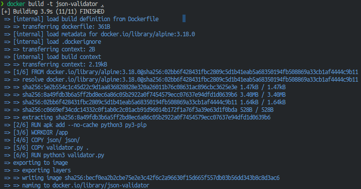
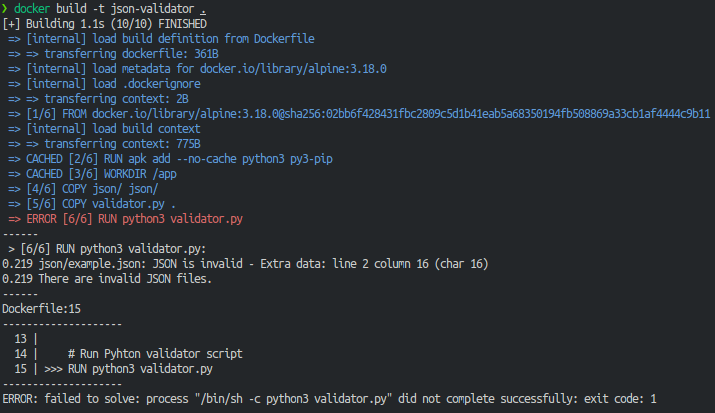
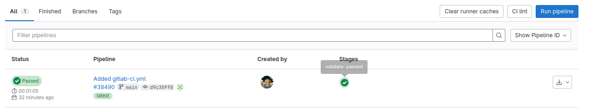
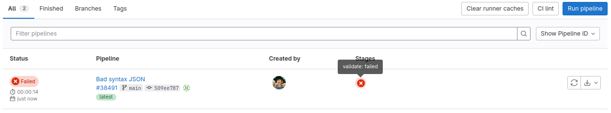

## Evaluating Options for JSON File Validation
### Introduction
This documentation shows the process of creating two scenarios with the same goal, to validate one or more JSON files before or during the creation of a Docker container.
#### Requirements
- Docker installed. In this case, the installation was performed using a [convenience script](https://get.docker.com/).
- [Python3](https://www.python.org/downloads/) for validation script-based option.

### Option 1: Python script validation via Dockerfile. 
_(Not recommended)_

This first option uses a Python script to validate the JSON file during container construction. The script is run on the Dockerfile, which allows you to verify the validity during the creation of the container.

#### Directory Structure

```plaintext
~/json-validator/
├── Dockerfile
├── validator.py
└── json/
    └── example.json
```

#### Python validation script

<a href="./validation.py">This script</a> will be executed during the Docker build process.
1) Evaluate if the json directory exists and if it contains one or more json files.
2) Check the syntax of one or more json using the python built-in json module.

#### Dockerfile

The <a href="./Dockerfile">Dockerfile</a> will use an alpine 3.18.0 image for this example and install two dependencies needed for the script to work _(python3, py3-pip)_.

After this and during the creation of the container, it will run the script shown above which will validate an <a href="./json/example.json">example JSON file</a> located in `./json/example.json`.

**Example scenarios**

##### Scenario 1: JSON File **WITHOUT** syntax errors.

When trying to build a container using this Dockerfile and the JSON does not contain syntax errors, the execution will not report any errors or display details.
<div align="center">
    
</div>

##### Scenario 2: JSON File **WITH** syntax errors.

In addition to some possible errors such as the non-existence of one or more json files or parent directory, if the script fails the container build will also fail and will show which file contains errors.

In addition, it will show which JSON files contain errors.

<div align="center">
    
</div>

- - -

### Option 2: Validation with GitLab CD/CI pipeline. 
_(Recommended)_

The same structure and project has been used except that, in this case, the <a href="./.gitlab-ci.yml">.gitlab-ci.yml</a> file has been added to the project root to define the pipeline.

GitLab CI/CD Pipeline Configuration

The following configuration will ensure that the pipeline only runs when a merge is made to the `main` or `master` branch:
1) Stages: Defines the stages of the pipeline, here will be only the json validation stage for now.
2) Validate JSON job:
- _Image:_ Uses a Python 3.9 image to run the validation script.
- _Script:_ Runs the same <a href="./validation.py">validation script</a> as before.
- _Rules:_ In this case it has been defined that the pipeline will only be executed when a commit is made to the `main` or `master` branch.

**Example scenarios**

##### Scenario 1: JSON File WITHOUT syntax errors.

If JSON files do not contain syntax errors, the pipeline will succeed, and GitLab will show the pipeline status as passed.

<div align="center">
    
</div>

##### Scenario 2: JSON File WITH syntax errors.

If JSON files contain syntax errors, the pipeline will fail, and GitLab will show the pipeline status as failed. 
The job log will display the specific syntax errors encountered.

<div align="center">
    
</div>

### Summary: Why Pipeline Validation is Better
Using a CI/CD pipeline for JSON validation offers several advantages over validating within the Dockerfile:
1) **Separation of Concerns**: Keeping validation logic out of the Docker build process ensures that the Dockerfile remains focused on building the container image, following the principle of separation of concerns.
2) **Early Feedback**: Validation happens before the Docker image is built, providing immediate feedback to developers and preventing the build process from wasting resources on invalid JSON files.
3) **Scalability**: Pipelines can easily be extended to include additional validation steps, tests, or deployment processes without modifying the Dockerfile.